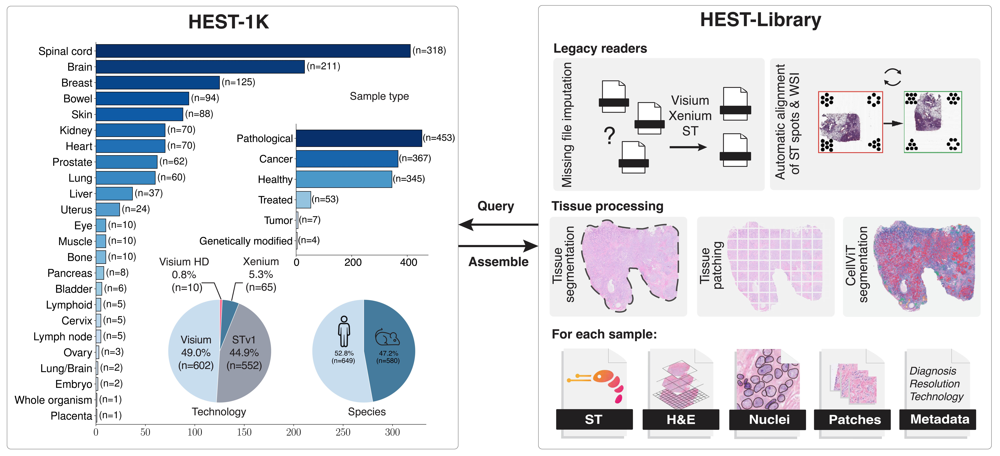

# HEST-Library: Bringing Spatial Transcriptomics and Histopathology together
## Designed for querying and assembling HEST-1k dataset 

\[ [arXiv](https://arxiv.org/abs/2406.16192) | [Data](https://huggingface.co/datasets/MahmoodLab/hest) | [Documentation](https://hest.readthedocs.io/en/latest/) | [Tutorials](https://github.com/mahmoodlab/HEST/tree/main/tutorials) | [Cite](https://github.com/mahmoodlab/hest?tab=readme-ov-file#citation) \]
<!-- [ArXiv (stay tuned)]() | [Interactive Demo](http://clam.mahmoodlab.org) | [Cite](#reference) -->

Welcome to the official GitHub repository of the HEST-Library introduced in *"HEST-1k: A Dataset for Spatial Transcriptomics and Histology Image Analysis", NeurIPS Spotlight, 2024*. This project was developed by the [Mahmood Lab](https://faisal.ai/) at Harvard Medical School and Brigham and Women's Hospital. 



<br/>

### What does this repository provide?
- **HEST-1k:** Free access to <b>HEST-1K</b>, a dataset of 1,229 paired Spatial Transcriptomics samples with HE-stained whole-slide images 
- **HEST-Library:** A series of helpers to assemble new ST samples (ST, Visium, Visium HD, Xenium) and work with HEST-1k (ST analysis, batch effect viz and correction, etc.)
- **HEST-Benchmark:** A new benchmark to assess the predictive performance of foundation models for histology in predicting gene expression from morphology 

HEST-1k, HEST-Library, and HEST-Benchmark are released under the Attribution-NonCommercial-ShareAlike 4.0 International license. 

<br/>

## Updates

- **21.10.24**: HEST has been accepted to NeurIPS 2024 as a Spotlight! We will be in Vancouver from Dec 10th to 15th. Send us a message if you wanna learn more about HEST (gjaume@bwh.harvard.edu). 

- **23.09.24**: 121 new samples released, including 27 Xenium and 7 Visium HD! We also make the aligned Xenium transcripts + the aligned DAPI segmented cells/nuclei public.

- **30.08.24**: HEST-Benchmark results updated. Includes H-Optimus-0, Virchow 2, Virchow, and GigaPath. New COAD task based on 4 Xenium samples. HuggingFace bench data have been updated. 

- **28.08.24**: New set of helpers for batch effect visualization and correction. Tutorial [here](https://github.com/mahmoodlab/HEST/blob/main/tutorials/5-Batch-effect-visualization.ipynb). 

## Download/Query HEST-1k (>1TB)

To download/query HEST-1k, follow the tutorial [1-Downloading-HEST-1k.ipynb](https://github.com/mahmoodlab/HEST/blob/main/tutorials/1-Downloading-HEST-1k.ipynb) or follow instructions on [Hugging Face](https://huggingface.co/datasets/MahmoodLab/hest).

**NOTE:** The entire dataset weighs more than 1TB but you can easily download a subset by querying per id, organ, species...


## HEST-Library installation

```
git clone https://github.com/mahmoodlab/HEST.git
cd HEST
conda create -n "hest" python=3.9
conda activate hest
pip install -e .
```

#### Additional dependencies (for WSI manipulation):
```
sudo apt install libvips libvips-dev openslide-tools
```

#### Additional dependencies (GPU acceleration):
If a GPU is available on your machine, we recommend installing [cucim](https://docs.rapids.ai/install) on your conda environment. (hest was tested with `cucim-cu12==24.4.0` and `CUDA 12.1`)
```
pip install \
    --extra-index-url=https://pypi.nvidia.com \
    cudf-cu12==24.6.* dask-cudf-cu12==24.6.* cucim-cu12==24.6.* \
    raft-dask-cu12==24.6.*
```

**NOTE:** HEST-Library was only tested on Linux/macOS machines, please report any bugs in the GitHub issues.

## Inspect HEST-1k with HEST-Library

You can then simply view the dataset as, 

```python
from hest import iter_hest

for st in iter_hest('../hest_data', id_list=['TENX95']):
    print(st)
```

## HEST-Library API

The HEST-Library allows **assembling** new samples using HEST format and **interacting** with HEST-1k. We provide two tutorials:

- [2-Interacting-with-HEST-1k.ipynb](https://github.com/mahmoodlab/HEST/tree/main/tutorials/2-Interacting-with-HEST-1k.ipynb): Playing around with HEST data for loading patches. Includes a detailed description of each scanpy object. 
- [3-Assembling-HEST-Data.ipynb](https://github.com/mahmoodlab/HEST/tree/main/tutorials/3-Assembling-HEST-Data.ipynb): Walkthrough to transform a Visum sample into HEST.
- [5-Batch-effect-visualization.ipynb](https://github.com/mahmoodlab/HEST/blob/main/tutorials/5-Batch-effect-visualization.ipynb): Batch effect visualization and correction (MNN, Harmony, ComBat).

In addition, we provide complete [documentation](https://hest.readthedocs.io/en/latest/).

## HEST-Benchmark

The HEST-Benchmark was designed to assess 11 foundation models for pathology under a new, diverse, and challenging benchmark. HEST-Benchmark includes nine tasks for gene expression prediction (50 highly variable genes) from morphology (112 x 112 um regions at 0.5 um/px) in nine different organs and eight cancer types. We provide a step-by-step tutorial to run HEST-Benchmark and reproduce our results in [4-Running-HEST-Benchmark.ipynb](https://github.com/mahmoodlab/HEST/tree/main/tutorials/4-Running-HEST-Benchmark.ipynb).

### HEST-Benchmark results (08.30.24)

HEST-Benchmark was used to assess 11 publicly available models.
Reported results are based on a Ridge Regression with PCA (256 factors). Ridge regression unfairly penalizes models with larger embedding dimensions. To ensure fair and objective comparison between models, we opted for PCA-reduction. 
Model performance measured with Pearson correlation. Best is **bold**, second best
is _underlined_. Additional results based on Random Forest and XGBoost regression are provided in the paper. 

| Model                  | IDC    | PRAD   | PAAD   | SKCM   | COAD   | READ   | ccRCC  | LUAD   | LYMPH IDC | Average |
|------------------------|--------|--------|--------|--------|--------|--------|--------|--------|-----------|---------|
| **[Resnet50](https://arxiv.org/abs/1512.03385)**      | 0.4741 | 0.3075 | 0.3889 | 0.4822 | 0.2528 | 0.0812 | 0.2231 | 0.4917 | 0.2322    | 0.326   |
| **[CTransPath](https://www.sciencedirect.com/science/article/abs/pii/S1361841522002043)**         | 0.511  | 0.3427 | 0.4378 | 0.5106 | 0.2285 | 0.11   | 0.2279 | 0.4985 | 0.2353    | 0.3447  |
| **[Phikon](https://huggingface.co/owkin/phikon)**            | 0.5327 | 0.342  | 0.4432 | 0.5355 | 0.2585 | 0.1517 | 0.2423 | 0.5468 | 0.2373    | 0.3656  |
| **[CONCH](https://huggingface.co/MahmoodLab/CONCH)**             | 0.5363 | 0.3548 | 0.4475 | 0.5791 | 0.2533 | 0.1674 | 0.2179 | 0.5312 | 0.2507    | 0.3709  |
| **[Remedis](https://arxiv.org/abs/2205.09723)**            | 0.529  | 0.3471 | 0.4644 | 0.5818 | 0.2856 | 0.1145 | 0.2647 | 0.5336 | 0.2473    | 0.3742  |
| **[Gigapath](https://huggingface.co/prov-gigapath/prov-gigapath)**          | 0.5508 | _0.3708_ | 0.4768 | 0.5538 | _0.301_ | 0.186 | 0.2391 | 0.5399 | 0.2493    | 0.3853  |
| **[UNI](https://huggingface.co/MahmoodLab/UNI)**                | 0.5702 | 0.314  | 0.4764 | 0.6254 | 0.263  | 0.1762 | 0.2427 | 0.5511 | 0.2565    | 0.3862  |
| **[Virchow](https://huggingface.co/paige-ai/Virchow)**            | 0.5702 | 0.3309 | 0.4875 | 0.6088 | **0.311** | 0.2019 | 0.2637 | 0.5459 | 0.2594    | 0.3977  |
| **[Virchow2](https://huggingface.co/paige-ai/Virchow2)**           | 0.5922 | 0.3465 | 0.4661 | 0.6174 | 0.2578 | 0.2084 | **0.2788** | **0.5605** | 0.2582    | 0.3984  |
| **UNIv1.5**            | **0.5989** | 0.3645 | _0.4902_ | _0.6401_ | 0.2925 | _0.2240_ | 0.2522 | _0.5586_ | **0.2597** | _0.4090_ |
| **[Hoptimus0](https://github.com/bioptimus/releases/blob/main/models/h-optimus/v0/LICENSE.md)**        | _0.5982_ | **0.385** | **0.4932** | **0.6432** | 0.2991 | **0.2292** | _0.2654_ | 0.5582 | _0.2595_ | **0.4146** |


### Benchmarking your own model

Our tutorial in [4-Running-HEST-Benchmark.ipynb](https://github.com/mahmoodlab/HEST/tree/main/tutorials/4-Running-HEST-Benchmark.ipynb) will guide users interested in benchmarking their own model on HEST-Benchmark.

**Note:** Spontaneous contributions are encouraged if researchers from the community want to include new models. To do so, simply create a Pull Request. 

## Issues 
- The preferred mode of communication is via GitHub issues.
- If GitHub issues are inappropriate, email `gjaume@bwh.harvard.edu` (and cc `homedoucetpaul@gmail.com`). 
- Immediate response to minor issues may not be available.

## Citation

If you find our work useful in your research, please consider citing:

Jaume, G., Doucet, P., Song, A. H., Lu, M. Y., Almagro-Perez, C., Wagner, S. J., Vaidya, A. J., Chen, R. J., Williamson, D. F. K., Kim, A., & Mahmood, F. HEST-1k: A Dataset for Spatial Transcriptomics and Histology Image Analysis. _Advances in Neural Information Processing Systems_, December 2024.

```
@inproceedings{jaume2024hest,
    author = {Guillaume Jaume and Paul Doucet and Andrew H. Song and Ming Y. Lu and Cristina Almagro-Perez and Sophia J. Wagner and Anurag J. Vaidya and Richard J. Chen and Drew F. K. Williamson and Ahrong Kim and Faisal Mahmood},
    title = {HEST-1k: A Dataset for Spatial Transcriptomics and Histology Image Analysis},
    booktitle = {Advances in Neural Information Processing Systems},
    year = {2024},
    month = dec,
}

```

 
