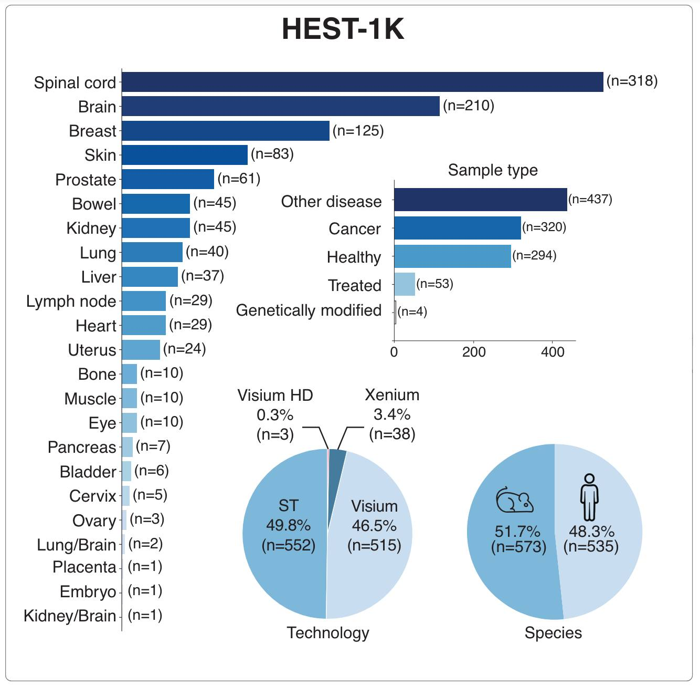

# HEST-Library: Bringing Spatial Transcriptomics and Histopathology together
## Designed for querying and assembling HEST-1k dataset 

\[ [arXiv](https://arxiv.org/abs/2406.16192) | [HEST-1k](https://huggingface.co/datasets/MahmoodLab/hest) \]
<!-- [ArXiv (stay tuned)]() | [Interactive Demo](http://clam.mahmoodlab.org) | [Cite](#reference) -->



Welcome to the official GitHub repository of the HEST-Library introduced in *"HEST-1k: A Dataset for Spatial Transcriptomics and Histology Image Analysis"*. This project was developed by the [Mahmood Lab](https://faisal.ai/) at Harvard Medical School and Brigham and Women's Hospital. 

HEST-1k, HEST-Library, and HEST-Benchmark are released under the Attribution-NonCommercial-ShareAlike 4.0 International license. 

<br/>

### What does this repository provide?
- **HEST-1k:** Free access to <b>HEST-1K</b>, a dataset of 1,108 paired Spatial Transcriptomics samples with HE-stained whole-slide images 
- **HEST-Library:** A series of helpers to assemble new ST samples (ST, Visium, Visium HD, Xenium) and work with HEST-1k (ST analysis, batch effect viz and correction, etc.)
- **HEST-Benchmark:** A new benchmark to assess the predictive performance of foundation models for histology in predicting gene expression from morphology 

<br/>

## Updates

- **23.09.24**: 121 new samples released, including 27 Xenium and 7 Visium HD! We also make the aligned Xenium transcripts + the aligned DAPI segmented cells/nuclei public.

- **30.08.24**: HEST-Benchmark results updated. Includes H-Optimus-0, Virchow 2, Virchow, and GigaPath. New COAD task based on 4 Xenium samples. HuggingFace bench data have been updated. 

- **28.08.24**: New set of helpers for batch effect visualization and correction. Tutorial [here](https://github.com/mahmoodlab/HEST/blob/main/tutorials/5-Batch-effect-visualization.ipynb). 

## Download/Query HEST-1k (>1TB)

To download/query HEST-1k, follow the tutorial [1-Downloading-HEST-1k.ipynb](https://github.com/mahmoodlab/HEST/blob/main/tutorials/1-Downloading-HEST-1k.ipynb) or follow instructions on [Hugging Face](https://huggingface.co/datasets/MahmoodLab/hest).

**NOTE:** The entire dataset weighs more than 1TB but you can easily download a subset by querying per id, organ, species...


## HEST-Library installation

```
git clone https://github.com/mahmoodlab/HEST.git
cd HEST
conda create -n "hest" python=3.9
conda activate hest
pip install -e .
```

#### Additional dependencies (for WSI manipulation):
```
sudo apt install libvips libvips-dev openslide-tools
```

#### Additional dependencies (GPU acceleration):
If a GPU is available on your machine, we recommend installing [cucim](https://docs.rapids.ai/install) on your conda environment. (hest was tested with `cucim-cu12==24.4.0` and `CUDA 12.1`)
```
pip install \
    --extra-index-url=https://pypi.nvidia.com \
    cudf-cu12==24.6.* dask-cudf-cu12==24.6.* cucim-cu12==24.6.* \
    raft-dask-cu12==24.6.*
```

**NOTE:** HEST-Library was only tested on Linux/macOS machines, please report any bugs in the GitHub issues.

## Inspect HEST-1k with HEST-Library

You can then simply view the dataset as, 

```python
from hest import iter_hest

for st in iter_hest('../hest_data', id_list=['TENX95']):
    print(st)
```

## HEST-Library API

The HEST-Library allows **assembling** new samples using HEST format and **interacting** with HEST-1k. We provide two tutorials:

- [2-Interacting-with-HEST-1k.ipynb](https://github.com/mahmoodlab/HEST/tree/main/tutorials/2-Interacting-with-HEST-1k.ipynb): Playing around with HEST data for loading patches. Includes a detailed description of each scanpy object. 
- [3-Assembling-HEST-Data.ipynb](https://github.com/mahmoodlab/HEST/tree/main/tutorials/3-Assembling-HEST-Data.ipynb): Walkthrough to transform a Visum sample into HEST.
- [5-Batch-effect-visualization.ipynb](https://github.com/mahmoodlab/HEST/blob/main/tutorials/5-Batch-effect-visualization.ipynb): Batch effect visualization and correction (MNN, Harmony, ComBat).

In addition, we provide complete [documentation](https://hest.readthedocs.io/en/latest/).

## HEST-Benchmark

The HEST-Benchmark was designed to assess foundation models for pathology under a new, diverse, and challenging benchmark. HEST-Benchmark includes 10 tasks for gene expression prediction (50 highly variable genes) from morphology (112 x 112 um regions at 0.5 um/px) in 10 different organs and 9 cancer types. We provide a step-by-step tutorial to run HEST-Benchmark and reproduce our results in [4-Running-HEST-Benchmark.ipynb](https://github.com/mahmoodlab/HEST/tree/main/tutorials/4-Running-HEST-Benchmark.ipynb).

### HEST-Benchmark results (08.30.24)

HEST-Benchmark was used to assess 10 publicly available models.
Reported results are based on a Ridge Regression with PCA (256 factors). Ridge regression unfairly penalizes models with larger embedding dimensions. To ensure fair and objective comparison between models, we opted for PCA-reduction. 
Model performance measured with Pearson correlation. Best is **bold**, second best
is _underlined_. Additional results based on Random Forest and XGBoost regression are provided in the paper. 

| **Dataset**   |   **[Hoptimus0](https://github.com/bioptimus/releases/blob/main/models/h-optimus/v0/LICENSE.md)** |   **[Virchow2](https://huggingface.co/paige-ai/Virchow2)** |   **[Virchow](https://huggingface.co/paige-ai/Virchow)** |   **[UNI](https://huggingface.co/MahmoodLab/UNI)** |   **[Gigapath](https://huggingface.co/prov-gigapath/prov-gigapath)** |   **[CONCH](https://huggingface.co/MahmoodLab/CONCH)** |   **[Phikon](https://huggingface.co/owkin/phikon)** |   **[Remedis](https://arxiv.org/abs/2205.09723)** |   **[CTransPath](https://www.sciencedirect.com/science/article/abs/pii/S1361841522002043)** |   **[Resnet50](https://arxiv.org/abs/1512.03385)** |   **[Plip](https://www.nature.com/articles/s41591-023-02504-3)** |
|:--------------|----------------:|---------------:|--------------:|-------------:|---------------:|---------------:|-------------:|--------------:|-----------------:|---------------:|-----------:|
| **IDC**       |          **0.5988** |         0.5903 |        0.5725 |       0.5718 |         0.5505 |         0.5363 |       0.5327 |        0.5304 |           0.511  |         0.4732 |     0.4717 |
| **PRAD**      |          0.3768 |         0.3478 |        0.3341 |       0.3095 |         **0.3776** |         0.3548 |       0.342  |        0.3531 |           0.3427 |         0.306  |     0.2819 |
| **PAAD**      |          **0.4936** |         0.4716 |        0.4926 |       0.478  |         0.476  |         0.4475 |       0.4441 |        0.4647 |           0.4378 |         0.386  |     0.4099 |
| **SKCM**      |          **0.6521** |         0.613  |        0.6056 |       0.6344 |         0.5607 |         0.5784 |       0.5334 |        0.5816 |           0.5103 |         0.4825 |     0.5117 |
| **COAD**      |          0.3054 |         0.252  |        **0.3115** |       0.2876 |         0.2595 |         0.2579 |       0.2573 |        0.2528 |           0.249  |         0.231  |     0.0518 |
| **READ**      |          **0.2209** |         0.2109 |        0.1999 |       0.1822 |         0.1888 |         0.1617 |       0.1631 |        0.1216 |           0.1131 |         0.0842 |     0.0927 |
| **CCRCC**     |          0.2717 |         **0.275**  |        0.2638 |       0.2402 |         0.2436 |         0.2179 |       0.2423 |        0.2643 |           0.2279 |         0.218  |     0.1902 |
| **LUNG**      |          **0.5605** |         0.5554 |        0.5433 |       0.5499 |         0.5412 |         0.5317 |       0.5522 |        0.538  |           0.5049 |         0.4919 |     0.4838 |
| **LYMPH_IDC** |          0.2578 |         **0.2598** |        0.2582 |       0.2537 |         0.2491 |         0.2507 |       0.2373 |        0.2465 |           0.2354 |         0.2284 |     0.2382 |
| **AVG**       |          **0.4153** |         0.3973 |        0.3979 |       0.3897 |         0.383  |         0.3708 |       0.3672 |        0.3726 |           0.348  |         0.3224 |     0.3035 |


### Benchmarking your own model

Our tutorial in [4-Running-HEST-Benchmark.ipynb](https://github.com/mahmoodlab/HEST/tree/main/tutorials/4-Running-HEST-Benchmark.ipynb) will guide users interested in benchmarking their own model on HEST-Benchmark.

**Note:** Spontaneous contributions are encouraged if researchers from the community want to include new models. To do so, simply create a Pull Request. 

## Issues 
- The preferred mode of communication is via GitHub issues.
- If GitHub issues are inappropriate, email `gjaume@bwh.harvard.edu` (and cc `pdoucet@bwh.harvard.edu`). 
- Immediate response to minor issues may not be available.

## Citation

If you find our work useful in your research, please consider citing:
```
@article{jaume2024hest,
	author = {Jaume, Guillaume and Doucet, Paul and Song, Andrew H. and Lu, Ming Y. and Almagro-Perez, Cristina and Wagner, Sophia J. and Vaidya, Anurag J. and Chen, Richard J. and Williamson, Drew F. K. and Kim, Ahrong and Mahmood, Faisal},
	title = {{HEST-1k: A Dataset for Spatial Transcriptomics and Histology Image Analysis}},
	journal = {arXiv},
	year = {2024},
	month = jun,
	eprint = {2406.16192},
	url = {https://arxiv.org/abs/2406.16192v1}
}
```

 
