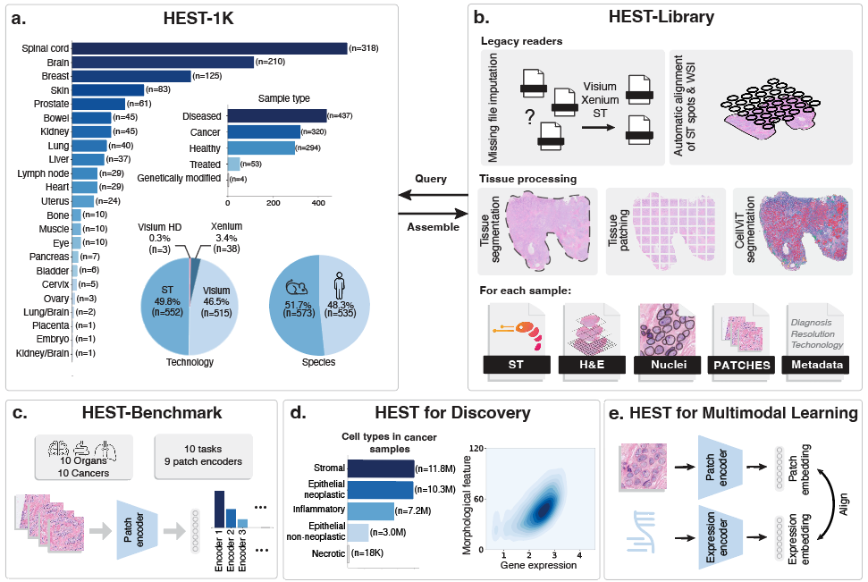

# HEST


Hest provides legacy readers for the different Spatial Transcriptomics data formats supporting H&E (Visium/Visium-HD, Xenium and ST) and for automatically aligning them with their associated histology image. Hest was used to assemble the HEST-1k dataset, processing challenging ST datasets from a wide variety of sources and converting them to formats commonly used in pathology (.tif, Scanpy AnnData). The framework also provides helper functions for pooling transcripts and tesselating slides into patches centered around ST spots.

<p align="center">
  
</p>

The main strength of hest is its ability to read ST samples even when files are missing, for example hest is able to read a Visium sample even if only `filtered_bc_matrix.h5` (or a `mex` folder) and a `full_resolution.tif` are provided.

<br/>

1. [Installation](#installation)
2. [Information for reviewers](#information-for-reviewers)
3. [Hest-lib tutorials](#tutorials) \
3.1 [Hest reader API](#hest-reader-api) \
3.2 [Hest bench](#hest-bench-tutorial)
<br/>


# Installation

```
conda create -n "hest" python=3.9
conda activate hest
pip install -e .
```

NOTE: hest was only tested on linux/macOS machines, please report any bugs in the GitHub issues.

## Install CONCH/UNI (Optional, for HEST-bench only)

If you want to benchmark CONCH/UNI, additional steps are necesary

### Install CONCH (model + weights)

1. Request access to the model weights from the Huggingface model page [here](https://huggingface.co/MahmoodLab/CONCH).

2. Download the model weights (`pytorch_model.bin`) and place them in your `fm_v1` directory `fm_v1/conch_v1_official/pytorch_model.bin`

3. Install the CONCH PyTorch model:

```
git clone https://github.com/mahmoodlab/CONCH.git
cd CONCH
pip install -e .
```

### Install UNI (weights only)

1. Request access to the model weights from the Huggingface model page [here](https://huggingface.co/MahmoodLab/UNI).

2. Download the model weights (`pytorch_model.bin`) and place them in your `fm_v1` directory `fm_v1/uni_v1_official/pytorch_model.bin`

# Information for reviewers


In order to reproduce the results of the HEST-benchmark (Table 1 and Suppl. Table 11), please follow the following steps:

1. Install HEST as explained in section 1

2. Download the benchmark task data `bench_data.zip` from [this link](https://drive.google.com/drive/folders/1x5envjv6lUfH9Hw13hXPIucMJELSJEKl) and unzip it to some directory

3. Download the patch encoder weights `fm_v1.zip` from [this link](https://drive.google.com/drive/folders/1x5envjv6lUfH9Hw13hXPIucMJELSJEKl) and unzip it to some directory

4. Then update the paths in the config file `bench_config/bench_config.yaml`

5. For reproducing Suppl. Table 11 with PCA, uncomment `dimreduce: "PCA"` in `bench_config/bench_config.yaml`


# Tutorials

## Hest reader API

## Reading legacy Visium files

### When should I provide an alignment file and when should I use the autoalignment?

#### Step 1: check if a tissue_positions.csv/tissue_position_list.csv already provides a correct alignment
Most of the time if a spatial/ folder containing a tissue_positions.csv/tissue_position_list.csv is available you don't need any autoalignment/alignment file. Try the following: `st = VisiumReader().read(fullres_img_path, bc_matric_path, spatial_coord_path=spatial_path)` (where `spatial_path` is a folder that contains a tissue_positions.csv or a tissue_position_list.csv), you can then double check the alignment (`st.save_spatial_plot(save_dir)`) by saving a visualization plot that takes the full resolution image, downscale it and overlays it with the spots. If the alignment looks off, try step 2.

#### Step 2: check if a .json alignment file is provided
If a .json alignment file is available, try the following `VisiumReader().read(fullres_img_path, bc_matric_path, spatial_coord_path=spatial_path, alignment_file_path=align_path)` you can also ommit the spatial_coord_path `VisiumReader().read(fullres_img_path, bc_matric_path, alignment_file_path=align_path)`


#### Step 3: attempt auto-alignment
If at least 3 corner fiducials are not cropped out and are reasonably visible, you can attempt an autoalignment with `VisiumReader().read(fullres_img_path, bc_matric_path`. (if no spatial folder and no alignment_file_path is provided, it will attempt autoalignment by default, you can always force auto-alignment by passing `autoalign='always'`)


### Reading from a filtered_feature_bc_matrix.h5, an image and a spatial/ folder
```python
from hest import VisiumReader

st = VisiumReader().read(
    fullres_img_path, # path to a full res image
    bc_matric_path, # path to filtered_feature_bc_matrix.h5
    spatial_coord_path=spatial_coord_path # path to a space ranger spatial/ folder containing either a tissue_positions.csv or tissue_position_list.csv
)

# if no spatial folder is provided, but you have an alignment file
st = VisiumReader().read(
    fullres_img_path, # path to a full res image
    bc_matric_path, # path to filtered_feature_bc_matrix.h5
    alignment_file_path=alignment_file_path # path to a .json alignment file
)

# if both the alignment file and the spatial folder are missing, attempt autoalignment
st = VisiumReader().read(
    fullres_img_path, # path to a full res image
    bc_matric_path, # path to filtered_feature_bc_matrix.h5
)

```

### Auto read
Given that `visium_dir` contains a full resolution image and all the necessary Visium files such as the `filtered_bc_matrix.h5` and the `spatial` folder, `VisiumReader.auto_read(path)` should be able to automatically read the sample. Prefer `read` for a more fine grain control.

```python
from hest import VisiumReader

visium_dir = ...

# attempt autoread
st = VisiumReader().auto_read(visium_dir)
```


## Visualizing the spots over a fullres WSI
``` python
# visualize the spots over a downscaled version of the fullres image
st.save_spatial_plot(save_dir)
```

## Saving to pyramidal tiff and h5
Save `HESTData` object to `.tiff` + expression `.h5ad` and a metadata file.
``` python
# Warning saving a large image to pyramidal tiff (>1GB) can be slow on a hard drive !
st.save(save_dir, pyramidal=True)

```

## Patching and otsu-based tissue segmentation

Note that by default the whole WSI image is loaded in RAM to speed up the patching process,
if the image is too large to be loaded in RAM, you can pass `load_in_memory=False` but the patching will be slower.

```python
# By default the whole WSI image is loaded in RAM 
# to speed up the patching process
load_in_memory = True

st.dump_patches(
    patch_save_dir,
    'demo',
    target_patch_size=224,
    target_pixel_size=0.5,
    load_in_memory=load_in_memory
)
```

## Hest-bench tutorial

In order to benchmark your model with hest

1. Download the benchmark task data `bench_data.zip` from [this link](https://drive.google.com/drive/folders/1x5envjv6lUfH9Hw13hXPIucMJELSJEKl) and unzip it to some directory

2. Then modify the config file in `bench_config/bench_config.yaml`

### Benchmarking your own model

```python
from hest.bench import benchmark_encoder

PATH_TO_CONFIG = .. # path to `bench_config.yaml`
model = .. # PyTorch model (torch.nn.Module)
model_transforms = .. # transforms to apply during inference (torchvision.transforms.Compose)

benchmark_encoder(        
    model, 
    model_transforms,
    PATH_TO_CONFIG
)
```

### From the command-line

1. Add your model config in `src/hest/bench/cpath_model_zoo/pretrained_configs`
2. Launch the benchmark with:

```
python src/hest/bench/training/predict_expression.py --config bench_config/bench_config.yaml
```


## Query HEST-1k

Will be added during public release
